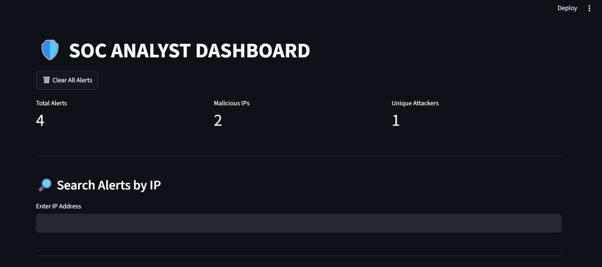
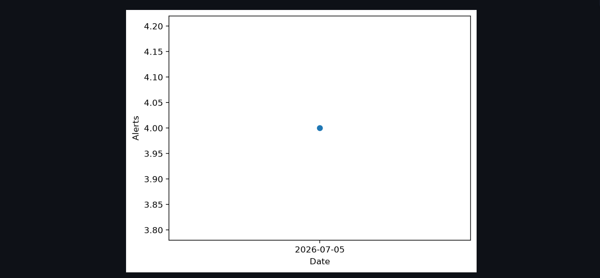
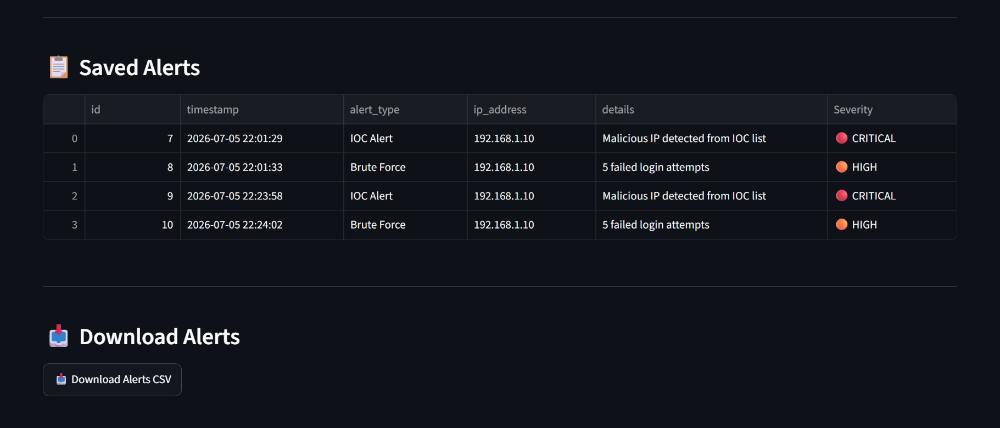
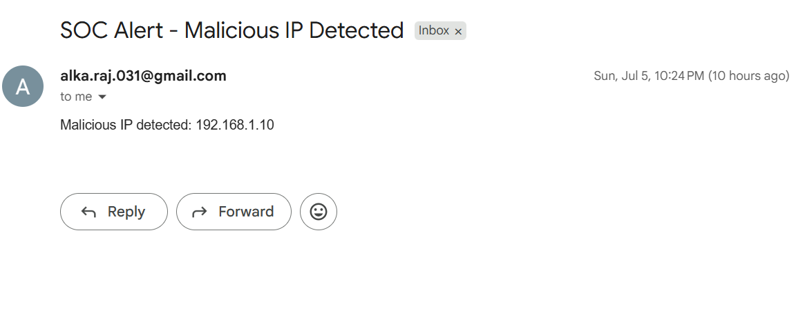

# 🛡️ SOC Analyst Dashboard

A Mini SOC/SIEM Dashboard built using Python, Streamlit, SQLite, AbuseIPDB API, and Email Notifications.

---

# Dashboard



---

# Charts


---

# Timeline



---

# Alerts



---

# Email Notification



---

# Features

- IOC Detection
- Brute Force Detection
- Threat Intelligence (AbuseIPDB)
- Email Alerts
- SQLite Database
- Streamlit Dashboard
- CSV Export
- PDF Report Generation
- Severity Levels
- Search Alerts
- Date Filters
- Bar Chart
- Pie Chart
- Timeline Graph
- Auto Refresh

---

# Technologies Used

- Python
- Streamlit
- SQLite
- Matplotlib
- AbuseIPDB API
- SMTP Email
- Git
- GitHub

---

# Project Workflow

```
Log Files
    │
    ▼
Log Parser
    │
    ▼
IOC Detection + Brute Force Detection
    │
    ▼
Threat Intelligence (AbuseIPDB)
    │
    ├────────► Email Alert
    │
    ▼
SQLite Database
    │
    ▼
Streamlit Dashboard
```

---

# Project Structure

```
soc-toolkit/
│
├── dashboard/
├── database/
├── iocs/
├── logs/
├── modules/
├── reports/
├── screenshots/
├── README.md
├── requirements.txt
└── .gitignore
```

---

# Setup Instructions

Before running this project, configure your own credentials.

## 1. Clone the Repository

```bash
git clone https://github.com/alka-alkaraj/soc-analyst-dashboard.git
cd soc-analyst-dashboard
```

---

## 2. Install Required Packages

```bash
pip install -r requirements.txt
```

---

## 3. Configure AbuseIPDB API Key

Create a free AbuseIPDB account and generate an API key.

Open:

```
modules/threat_intel.py
```

Replace:

```python
API_KEY = "YOUR_API_KEY"
```

with your own API key.

---

## 4. Configure Gmail App Password

Enable Two-Step Verification on your Gmail account.

Generate a Gmail App Password.

Open:

```
modules/email_sender.py
```

Replace:

```python
APP_PASSWORD = "YOUR_APP_PASSWORD"
```

with your own Gmail App Password.

---

## 5. Run the Dashboard

```bash
streamlit run dashboard/app.py
```

---

# Future Enhancements

- VirusTotal Integration
- Live Log Monitoring
- MITRE ATT&CK Mapping
- GeoIP Attack Visualization
- User Authentication
- Docker Deployment
- Real-Time Threat Monitoring

---

# Author

**Alka Raj**

**SOC Analyst Aspirant | Cybersecurity Enthusiast**